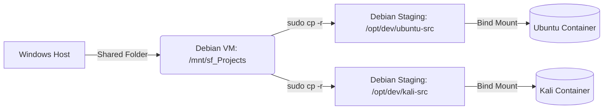

# Mounting Hellhole: Three-Layer Isolation Setup

>[!TIP] Query
>I like the bind mounts approach, how to do it. I have sf folder from windows to debian, but from debian to containers would be tricky. I am using podman, and also podman-compose, podman for ubuntu and kali using sudo and podman-compose for grafana, loki and promtail.
>
>I have two containers, one is ubuntu and kali, both run using sudo. It would be beneficial for me to bind mounts and later remove it, for architectural reasons. Again the main purpose is to share the code into the ubuntu and kali containers which are running on subo. And for the podman-compose containers, I can edit directly on the debian vm as I am not going inside them, I doubt I can go inside grafana, loki or promtail for anything useful, like with podman exec -it \<container\> bash
>
>Say if playing with different levels of root can be a problem what I can try is have two mount points, so from sf folder i can directly copy all that is required to mounts of ubuntu and kali and do stuff from there. It would mean I have to manually sudo cp with recursion, which is okay for me. Also response to the whole query.

---

This is a sophisticated setup. You are dealing with **three layers of isolation**:

1. **Windows Host** (Physical)
2. **Debian VM** (VirtualBox Guest / Podman Host)
3. **Containers** (Ubuntu/Kali running as Root via `sudo podman`)

Your intuition about using **two mount points** and `sudo cp` is actually a very robust "Air-Gapped Development" strategy. It prevents permission conflicts between your user (`vbox`) and the container's `root` user, and it keeps your source code clean.

Here is the precise architectural guide to implementing this.

---

## 🏗️ The Architecture: "The Staging Area"

Instead of mounting your Windows Shared Folder directly into the container (which can cause performance issues and permission headaches with `root`), we will use a **Staging Directory** on Debian.



### 🛠️ Step 1: Prepare the Staging Directories (On Debian)

Create dedicated folders for each container’s source code. Since your containers run as `root` (via `sudo`), it is best if these folders are owned by `root` to avoid permission errors when the container tries to write logs or temp files.

```bash
# Create staging directories
sudo mkdir -p /opt/dev/ubuntu-src
sudo mkdir -p /opt/dev/kali-src

# Set ownership to root (matches your sudo podman containers)
sudo chown -R root:root /opt/dev
```

### 📂 Step 2: The Sync Workflow (Manual Copy)

Whenever you update code in Windows (via the Shared Folder), sync it to the staging areas.

```bash
# Example: Syncing from Shared Folder to Ubuntu Staging
# Assuming your shared folder is mounted at /mnt/sf_Projects/control-api
sudo cp -r /mnt/sf_Projects/control-api/* /opt/dev/ubuntu-src/

# Example: Syncing to Kali Staging
sudo cp -r /mnt/sf_Projects/control-api/* /opt/dev/kali-src/
```

> **Why `sudo cp`?**
> If you copy as `vbox`, the files will be owned by `vbox`. When the container (running as `root`) tries to modify them, it might work, but if the container creates new files (like `__pycache__` or logs), they will be owned by `root`. This creates a "permission mismatch" where you (as `vbox`) can no longer delete or edit those new files on the host without `sudo`. Keeping everything as `root` avoids this mess.

### 🐳 Step 3: Bind Mounts in Podman

Now, run your containers pointing to these staging directories.

#### For Ubuntu Container

```bash
sudo podman run -d --name ubuntu-lab --replace --cap-add=NET_RAW --cap-add=NET_BIND_SERVICE --network lan1 --ip 192.168.50.10 -v ./10-opnsense.conf:/etc/rsyslog.d/10-opnsense.conf:ro -v ./logs:/var/log -v /opt/dev/ubuntu-src:/app ubuntu-lab:custom rsyslogd -n
```

#### For Kali Container

```bash
sudo podman run -d --name kali-lab --replace --cap-add=NET_RAW --cap-add=NET_ADMIN --security-opt seccomp=unconfined --network opt1 --ip 192.168.60.10 -v /opt/dev/kali-src:/app kali-lab:custom
```

**Key Flags Explained:**

* `-v /host/path:/container/path`: The bind mount.
* `:Z`: **Critical for SELinux/enabled systems.** Even if Debian doesn't enforce SELinux strictly, Podman often expects this label to ensure the container can access the host file. If you get "Permission Denied," try `:z` (lowercase) or remove it if on a non-SELinux system.
* `-w /app`: Sets the working directory inside the container.

---

### 🔄 Step 4: The "Hot-Reload" Problem & Solution

**The Issue:** Bind mounts reflect file *content* changes instantly, but if you replace a file entirely (like `cp` does), some applications (like Python) might not detect the change immediately if they are holding a file handle.

**The Solution:**

1. **For Python/FastAPI:** Use the `--reload` flag.

    ```bash
    # Inside the container command
    uvicorn app:app --host 0.0.0.0 --port 8000 --reload
    ```

    FastAPI’s reloader watches for file system events. `cp` usually triggers these events correctly.

2. **If Reload Fails:** Restart the container after copying.

    ```bash
    sudo cp -r /mnt/sf_Projects/control-api/* /opt/dev/ubuntu-src/
    sudo podman restart ubuntu-dev
    ```

---

### 🧹 Step 5: Cleaning Up (Architectural Removal)

You mentioned wanting to remove mounts for architectural reasons. Here is how to cleanly detach.

1. **Stop the Container:**

    ```bash
    sudo podman stop ubuntu-dev
    sudo podman rm ubuntu-dev
    ```

2. **Wipe the Staging Area (Optional):**

    ```bash
    sudo rm -rf /opt/dev/ubuntu-src/*
    ```

3. **Result:** The container is gone, the mount is detached, and your host filesystem is clean. No lingering volumes or anonymous mounts.

---

### ⚠️ Addressing Your Specific Concerns

#### 1. "Playing with different levels of root"

* **Problem:** If you edit files as `vbox` on Debian, but the container runs as `root`, you get permission errors.
* **Fix:** The `sudo cp` approach solves this. All files in `/opt/dev` are owned by `root`. The container (running as `root`) has full access. You (as `vbox`) need `sudo` to edit them on the host, which is a small price for stability.
* **Alternative:** If you hate using `sudo` to edit, you can add your user to the `root` group (not recommended) or use `ACLs`:

    ```bash
    sudo setfacl -R -m u:vbox:rwx /opt/dev/ubuntu-src
    ```

    This allows `vbox` to read/write files even if they are owned by `root`.

#### 2. "Podman-compose containers (Grafana/Loki)"

* You are correct: You rarely need to exec into Grafana/Loki.
* **Strategy:** Use **Named Volumes** for these, not bind mounts to source code.

    ```yaml
    # docker-compose.yml
    volumes:
      grafana-data:
        driver: local
    ```

    This keeps their data persistent but isolated from your manual file management.

#### 3. "Can I go inside them?"

* Yes, you can:

    ```bash
    sudo podman exec -it grafana-container /bin/sh
    ```

    But as you noted, it’s rarely useful for development. Stick to bind mounts for your **code** containers (Ubuntu/Kali) and named volumes for your **data** containers (Grafana/Loki).

### ✅ Summary Checklist

1. [ ] Create `/opt/dev/ubuntu-src` and `/opt/dev/kali-src` on Debian.
2. [ ] `sudo chown -R root:root /opt/dev`.
3. [ ] Edit code in Windows → Syncs to VBox Shared Folder.
4. [ ] Run `sudo cp -r /mnt/sf_.../* /opt/dev/.../` to stage.
5. [ ] Run `sudo podman run -v /opt/dev/...:/app ...` to start.
6. [ ] Use `--reload` in your app to catch changes.

This approach is clean, secure, and respects the boundary between your host user and container root.
